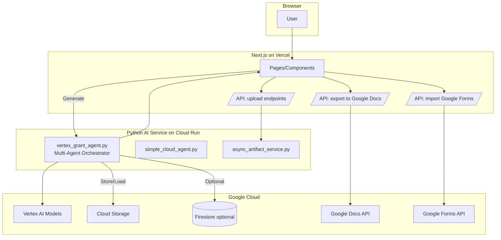

## Grant AI - System Architecture (High Level)

This document explains how the system works in plain English, with links to files.

### What users do
- Upload documents, enter basics about their project, and ask the app to draft a proposal.
- Review and refine the draft, then export to Google Docs.

### What the system does behind the scenes
- The website (Next.js on Vercel) shows pages and handles small API tasks like export/import.
- The AI service (Python on Google Cloud Run) performs the heavy AI work with Vertex AI.
- Google services provide AI models (Vertex AI) and document tools (Google Docs/Forms), plus storage and optional database.

### Key components and where they live
- Frontend (Next.js): `grant-proposal-frontend/`
  - UI pages: `src/app` and `src/components`
  - Small API routes: `src/pages/api/*` (e.g., `export/google-docs.ts`, `import/google-forms.ts`)
  - File upload handlers: `src/app/api/upload/*`, helpers in `src/lib/`
- Backend AI services (Python): repository root
  - Main multi-agent service: `vertex_grant_agent.py`
  - Simplified cloud service: `simple_cloud_agent.py`
  - Async artifact storage helper: `async_artifact_service.py`
- Deployment helpers: `Dockerfile`, `cloudbuild.yaml`, `deploy_cloud.sh`

### Data flow (end-to-end)
1. User uploads files via the web app.
2. Files are stored (via async artifact service or direct GCS).
3. Frontend invokes the AI service to generate a draft.
4. The AI service calls Vertex AI to analyze/write.
5. The draft is returned to the frontend for review.
6. User exports to Google Docs via the frontend API route.

### Diagram

### Operational notes
- Small, quick operations run close to users on Vercel; heavy AI work runs in Cloud Run near Vertex AI.
- Large uploads are chunked/resumable to tolerate flaky connections.
- Authentication can use Google OAuth to enable export to Docs and reading Forms responses.

### Next steps (optional improvements)
- Add a Cloud Run proxy for all Google APIs and centralize auth/safety.
- Tag and revalidate cached content on document updates (Vercel revalidation webhook).
- Add scheduled jobs to keep embeddings/RAG indices fresh.

